# Neural Synth Modeler

Neural Synth Modeler transforms audio inputs into synthesizer presets using deep learning. Given an audio sample, the model infers the optimal parameter settings for synthesizers to recreate that audio.

**Currently Supported:**
- [Vital](https://vital.audio/) - Wavetable synthesizer

## Model Architecture

The core model (`WTSv2`) is a neural wavetable synthesizer that learns to generate synthesizer parameters from audio features. Here's the detailed architecture:

### Feature Processing Pipeline

### Wavetable Generation & Processing

### ADSR Envelope Generation

### Complete Synthesis Pipeline

## MLOps Workflow

Our continuous training and deployment pipeline:

## Demo

Try it out on [our Colab notebook demo](https://colab.research.google.com/github/gudgud96/neural-synth-modeler/blob/main/Syntheon_Demo.ipynb).

## Project Structure

For each synthesizer, we define:

- **converter** for preset format conversion: 
    - `serializeToDict`: convert preset file to Python dictionary
    - `parseToPluginFile`: convert dictionary back to preset file

- **inferencer** for model inference:
    - `convert`: workflow of `load_model` -> `inference` -> `convert_to_preset`

