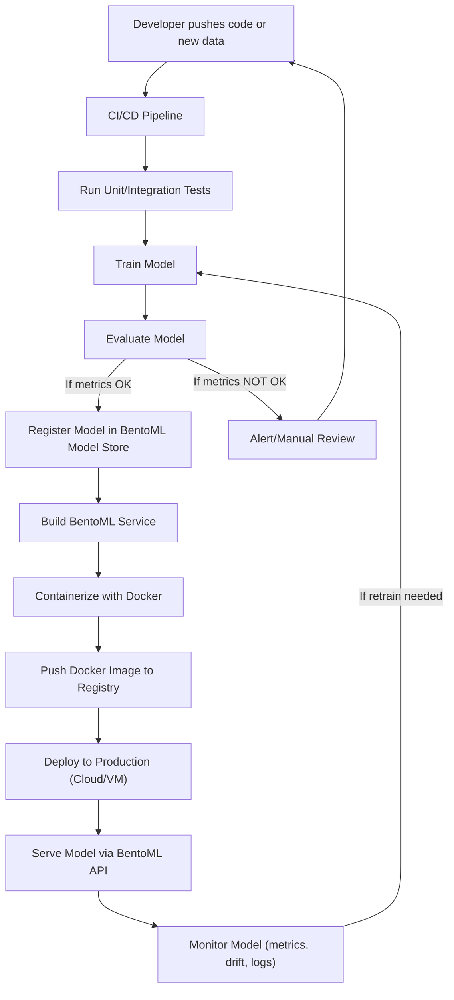

# MLOps Workflow for BentoML + Dockerized Model Serving

## Overview
This document outlines the MLOps workflow for continuous training and deployment of models using BentoML and Docker containers.

## Workflow Diagram

## Workflow Steps

1. **Code/Data Commit**: Developer pushes new code or data to the repository
2. **CI/CD Pipeline**: Automated pipeline is triggered (GitHub Actions, GitLab CI, etc.)
3. **Testing**: Run unit and integration tests to ensure code quality
4. **Model Training**: Train model with new data/code using the training pipeline
5. **Evaluation**: Evaluate model performance against validation/test sets
6. **Model Registry**: If metrics meet thresholds, register model in BentoML model store
7. **Service Build**: Build BentoML service with the new model
8. **Containerization**: Package the BentoML service as a Docker image
9. **Image Registry**: Push Docker image to container registry (Docker Hub, AWS ECR, etc.)
10. **Deployment**: Deploy container to production environment (cloud VM, server, etc.)
11. **Serving**: Serve model via BentoML API endpoints
12. **Monitoring**: Monitor model performance, data drift, and system logs
13. **Retraining Loop**: If drift or performance degradation detected, trigger retraining

## Key Components

- **BentoML**: Model serving framework for packaging and deploying ML models
- **Docker**: Containerization for consistent deployment across environments
- **CI/CD**: Automated pipeline for testing, training, and deployment
- **Model Registry**: Centralized storage for model versions and metadata
- **Monitoring**: Continuous monitoring of model performance and system health

## Benefits

- **Automated Workflow**: Reduces manual intervention and human error
- **Consistent Deployment**: Docker ensures reproducible deployments
- **Scalable Serving**: BentoML provides efficient model serving capabilities
- **Continuous Improvement**: Automated retraining based on performance monitoring
- **Version Control**: Track model versions and rollback if needed 